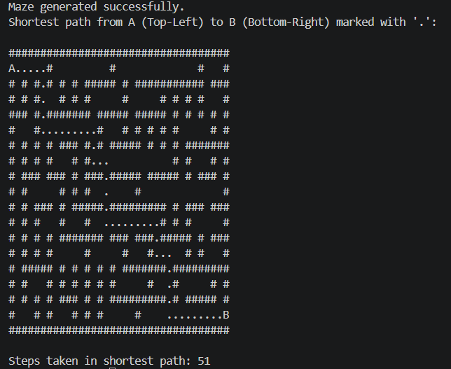

# Procedural Maze Generator & Solver

A simple yet effective C++ console application that procedurally generates random mazes and finds the shortest path through them using Graph Theory algorithms.

## Features
* **Procedural Generation**: Utilizes a randomized Prim's/DFS algorithm approach to generate complex mazes with multiple dead-ends.
* **Pathfinding**: Implements Breadth-First Search (BFS) to guarantee the shortest possible path between the start (A) and end (B) points.
* **Modern C++**: Uses the standard `random` library (engine `mt19937`), `unordered_map` for fast graph traversal, and avoids global namespace pollution.

## How it works
1. The maze is generated with random walls (`#`) and open paths (` `).
2. Point **A** is fixed at the top-left corner, and Point **B** is fixed at the bottom-right corner.
3. The BFS algorithm sweeps the grid, calculating the shortest route.
4. The path is then visualized in the console using dots (`.`).

## Getting Started

### Prerequisites
You need a C++ compiler that supports C++11 or later (e.g., MSVC, GCC, or Clang).

### Compilation & Execution
If you are using a terminal, you can compile and run the code using the following commands:

#### Option 1: Linux/macOS 

```bash
# Compile the code
g++ -std=c++17 main.cpp Maze.cpp -o maze_solver

# Run the executable (Linux/macOS)
./maze_solver
```

#### Option 2: Windows Terminal 

```powershell
# Compile the code using 'cl'
cl /EHsc main.cpp Maze.cpp /Fe:maze_solver.exe

# Run the executable
.\maze_solver.exe
```

### Example output

Here is an example of a procedurally generated maze with the shortest path calculated and drawn by the application:

